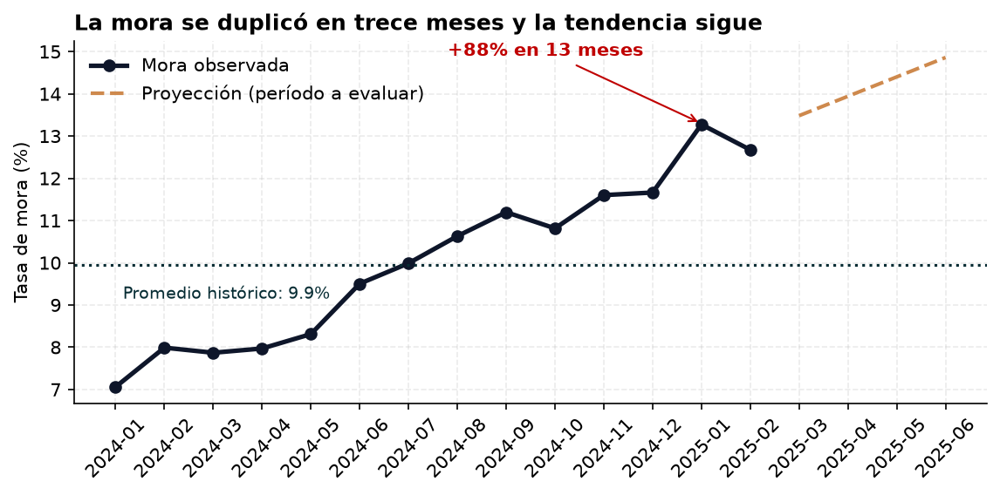
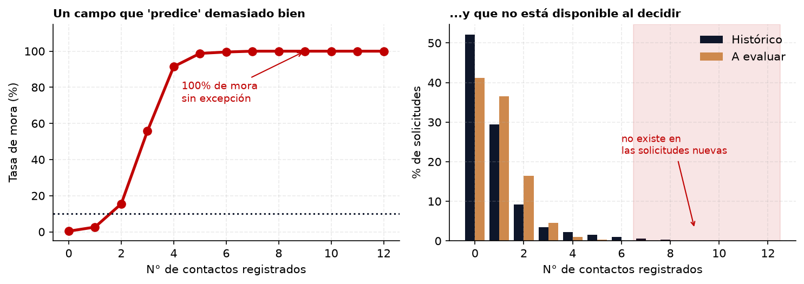
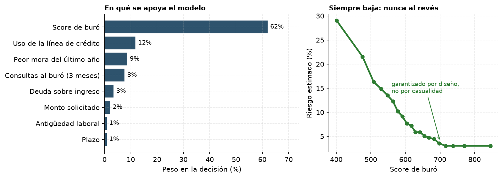
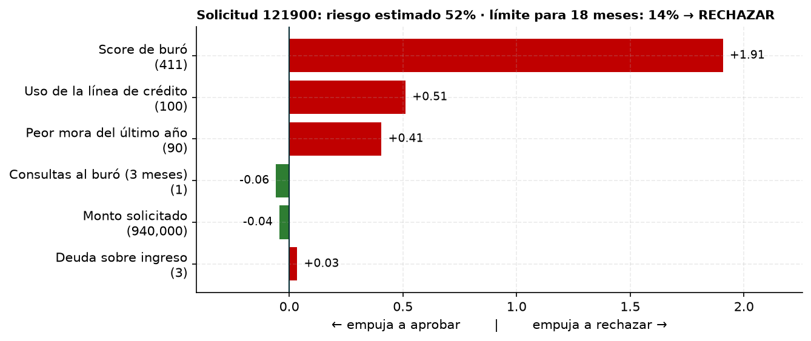
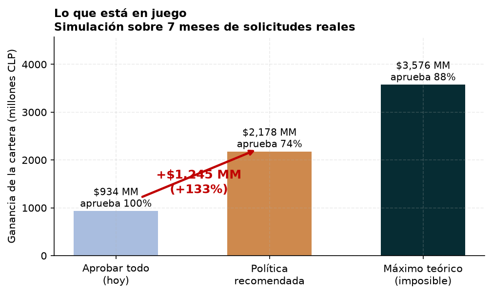

# Modelo de riesgo para aprobación de créditos de consumo

**Informe ejecutivo · Andina Crédito · Gerencia de Riesgo**

---

## Resumen en cinco líneas

Construimos un modelo que estima, para cada solicitud, la probabilidad de que el cliente caiga en mora. Simulado sobre siete meses de solicitudes reales, **aplicarlo habría generado $2.178 millones en vez de $934 millones**: un aumento de 133%, aprobando el 74% de las solicitudes en lugar del 100%. El modelo acierta en el orden de riesgo aproximadamente **8 de cada 10 veces** al comparar dos clientes cualesquiera. Durante el análisis detectamos un problema serio en la base de datos que, de no haberse corregido, habría producido un modelo aparentemente excelente e inservible en la práctica, y un segundo hallazgo que excede al modelo: más del 80% del alza de mora ocurre dentro de cada perfil de cliente, no por el tipo de cliente que llega. Recomendamos implementarlo con revisión de resultados a los tres meses.

---

## 1. El problema es real y está empeorando

La mora pasó de 7,1% a 13,3% entre enero de 2024 y enero de 2025: **casi el doble en trece meses**, sin ningún mes de reversión.

Dos cosas cambiaron en paralelo. El canal digital pasó de representar el 36% de las colocaciones al 69%, y ese canal tiene una mora de 12,5% frente al 7,2% de sucursal. A la vez, la cartera se rejuveneció: los solicitantes de hasta 21 años pasaron de 4,9% a 11,9% del volumen, y son el grupo más riesgoso (15,5% de mora, contra 7,3% en los mayores de 50).

**Pero medimos cuánto de la subida explican esos cambios, y la respuesta es: menos de un quinto.** El cambio de mezcla etaria explica 9% del alza, el de canal un 15%, y juntos —descontando que se solapan, porque los jóvenes llegan sobre todo por el canal digital— llegan al 19%.

**Más del 80% del deterioro ocurre dentro de cada perfil.** Un cliente de 40 a 49 años que llega por sucursal, el segmento más estable de toda la cartera, pasó de 6,8% a 10,6% de mora sin que su perfil cambiara en nada. El mismo tipo de cliente que hace un año es hoy sustancialmente más riesgoso.

Esto tiene una consecuencia incómoda que conviene decir de frente: **ningún modelo puede anticipar ese componente**, porque no está descrito por ninguna variable disponible. El modelo ordena bien a los clientes entre sí, pero el nivel general de riesgo sube por causas que la base de datos no registra. Es un tema para levantar con la gerencia: apunta a condiciones macroeconómicas, a relajamiento de las reglas de aprobación vigentes, o a cambios en la gestión de cobranza.

Con los parámetros actuales del producto —12% de interés anual y 55% de pérdida ante incumplimiento— **aprobar todas las solicitudes está hoy al borde de destruir valor**. No es una proyección: es lo que muestran los datos de los últimos meses.

---

## 2. Un problema en los datos que había que resolver primero

El campo `num_contactos_ult_trimestre` (contactos con el cliente) parecía la mejor variable predictiva de toda la base: con 4 contactos, el 91% de los clientes caía en mora; con 7 o más, **el 100% sin una sola excepción**.

Ningún dato conocido al momento de evaluar una solicitud puede separar así. La explicación es que ese campo registra **gestiones de cobranza posteriores al desembolso**: no anticipa la mora, la refleja. El gráfico de la derecha lo confirma: los valores altos simplemente no existen en las solicitudes nuevas, porque aún no ha pasado el tiempo para que se registren.

**Un modelo que usara ese campo reportaría una precisión sobresaliente y fallaría al aplicarse a solicitudes reales.** Lo excluimos. La decisión cuesta precisión en el papel y es la razón por la que las cifras de este informe son creíbles.

Otros hallazgos corregidos: un 10% de los ingresos venía registrado en miles de pesos en lugar de pesos, 299 solicitudes estaban duplicadas, y había 70 registros con edades imposibles (hasta 133 años).

> **Acción solicitada a Riesgo:** confirmar con el equipo de sistemas en qué momento se registra el campo de contactos. Si resultara estar disponible antes del desembolso, podría reincorporarse.

---

## 3. El modelo se puede explicar, caso por caso

El modelo se apoya principalmente en el **score de buró** (62% del peso), seguido del uso de la línea de crédito, la mora previa y las consultas recientes al buró. Son exactamente las variables que un analista experimentado revisaría.

El panel derecho muestra una decisión de diseño importante: **le impusimos al modelo que respete la lógica del negocio**. A mejor score, menor riesgo, siempre, sin excepciones ni zonas donde la curva se dé vuelta. Lo mismo con otras seis variables. Esto no salió por casualidad: es una restricción que verificamos una por una. Significa que nunca tendremos que explicar por qué un cliente con mejor perfil recibió peor evaluación.

### Ejemplo concreto: una solicitud rechazada

Para **cada** solicitud podemos entregar este desglose. En este caso: score de buró de 411, línea de crédito utilizada al 100% y 90 días de mora previa lo empujan al rechazo; el bajo número de consultas recientes y el monto moderado juegan a favor, pero no alcanzan. Riesgo estimado: 52%, contra un límite de 14% para un crédito a 18 meses.

*Este cliente efectivamente cayó en mora.*

Esto es lo que se le entrega al analista: no "el sistema dijo 52%", sino las razones ordenadas por peso. Es auditable y comunicable al cliente.

---

## 4. La política recomendada

La decisión de aprobar no depende solo del riesgo, sino de compararlo con lo que se gana y lo que se pierde. Para un crédito de $2.000.000 a 24 meses: si el cliente paga se ganan $240.000, si cae se pierden $1.100.000. **Se pierde 4,6 veces más de lo que se gana**, así que conviene aprobar mientras el riesgo esté bajo 17,9%.

Un resultado que conviene destacar: **el monto no cambia a quién se aprueba**, porque duplicarlo duplica tanto la ganancia como la pérdida. El plazo sí importa, porque los intereses se acumulan con el tiempo mientras la pérdida no. De ahí la regla recomendada:

| Plazo | Aprobar si el riesgo está bajo |
|:---:|:---:|
| 6 meses | 5,2% |
| 12 meses | 9,8% |
| 18 meses | 14,1% |
| 24 meses | 17,9% |
| 36 meses | 24,7% |
| 48 meses | 30,4% |

Aplicada sobre siete meses de solicitudes reales, la política habría generado **$1.245 millones adicionales**. La tercera barra es el máximo teórico si supiéramos el futuro con certeza: sirve para dimensionar que estamos capturando cerca de la mitad de lo posible.

**Hay margen para negociar.** La ganancia es estable entre 65% y 85% de aprobación, así que si Comercial requiere una meta de volumen distinta, se puede acomodar sin destruir valor. Lo caro es quedarse donde estamos hoy.

---

## 5. Limitaciones que deben quedar declaradas

**Las probabilidades subestiman el riesgo en 1 a 2 puntos.** El modelo aprendió de un período con menos mora que el actual. Podríamos haberlo ajustado hacia arriba, pero eso sería apostar a que la tendencia continúa exactamente igual, y no tenemos forma de comprobarlo. **Preferimos declararlo antes que corregirlo con un supuesto no verificable.** En la práctica, la política es algo menos conservadora de lo ideal. Se corrige sola al recalibrar con los primeros resultados observados.

**Solo conocemos a quienes fueron aprobados.** Todos los casos analizados pasaron el filtro actual. El modelo no sabe cómo se comportarían los que hoy se rechazan, y la política propuesta rechazaría a más gente todavía. La estimación de ganancia es válida para la población que hoy llega a desembolso.

**La ganancia es una estimación.** Está medida sobre datos históricos con resultado conocido. Sobre las solicitudes futuras es una proyección, no un hecho, y dado el deterioro documentado es más probable que rinda algo peor que mejor.

---

## 6. Recomendaciones

1. **Implementar la política de umbral por plazo** de la tabla de la sección 4.
2. **Recalibrar a los tres meses** con los primeros resultados observados, para cerrar la brecha declarada en la sección 5.
3. **Investigar el deterioro transversal.** El 80% del alza de mora no se explica por el perfil de los solicitantes. Es la pregunta más importante que deja este análisis y excede lo que un modelo puede responder: requiere revisar condiciones de mercado, reglas de aprobación vigentes y gestión de cobranza.
4. **Monitorear mensualmente la composición por canal y edad**, que siguen moviéndose en la misma dirección.
5. **Confirmar el origen del campo de contactos** con el equipo de sistemas.
6. **Revisar el proceso de carga de datos.** Los ingresos en unidades mezcladas y los registros duplicados sugieren que no hay validación en el punto de ingreso.

---

*Detalle metodológico completo en `notebooks/01_eda.ipynb` y `notebooks/02_modelo.ipynb`. Las cifras de este informe son reproducibles ejecutando esos notebooks.*
